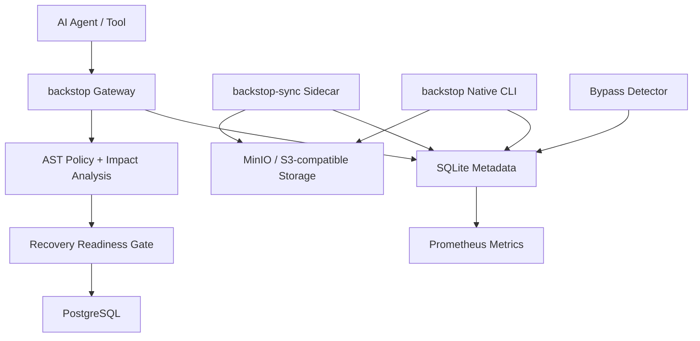

# backstop OSS Architecture

## Components

- `gateway`: MCP JSON-RPC entrypoint for agents. It classifies SQL, applies policy, waits for approvals, verifies recovery readiness, records audit metadata, and executes approved SQL.
- `sync`: sidecar that snapshots tables, writes snapshot manifests/data to object storage, records health/alerts, exposes metrics, and detects direct DB bypasses.
- `sdk/python`: CLI and SDK for snapshots, restore, native logical backups, PITR preparation, and WAL archive/fetch drills.
- `metadata`: SQLite database shared by local services for audit, approvals, snapshots, alerts, health, native backups, agent state, and restore events.

## Runtime Guarantees

backstop can only prevent dangerous operations that pass through the gateway. If an actor uses raw database credentials, backstop detects and alerts where possible, but prevention has been bypassed.

